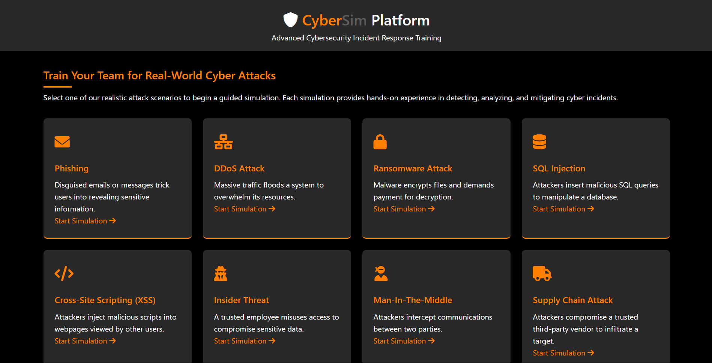
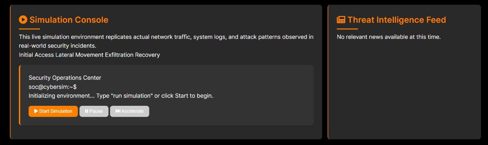

# Cyber Incident Response Simulation Platform


## Problem Statement

**Theme: Cyber Security**

**Problem 8: Cyber Incident Response Simulation Platform**  
**Use Case:** Create a simulation tool that allows companies to run mock cyber-attack drills and train their incident response teams.

Our project is based on this cybersecurity challenge, transforming traditional drills into a dynamic, interactive training platform.

---

## Overview

**CyberSim Platform** is an advanced cyber incident response simulation tool designed to train cybersecurity teams with realistic, hands-on scenarios. Users can choose from multiple attack scenarios and experience detailed simulations complete with animated steps, real-time threat intelligence, simulated SIEM logs, and interactive risk assessments. The platform also incorporates gamification elements and a virtual security mentor for a fully immersive training experience.

---

## Table of Contents

- [Features](#features)
- [Innovations](#innovations)
- [Architecture](#architecture)
- [Technology Stack](#technology-stack)
- [Installation & Setup](#installation--setup)
- [Usage](#usage)
- [Screenshots](#screenshots)
- [Team](#team)
- [Contact](#contact)

---

## Features

When you click on any attack scenario, the platform displays:

- **Attack Overview**  
- **Defensive Strategy**  
- **Simulation Console**  
- **Threat Intelligence Feed**  
- **Incident Response Playbook**  
- **Training Metrics**  
- **Incident Report**  
- **Virtual Security Mentor**  
- **SIEM Log Analysis**  
- **Risk Assessment**

---

## Innovations

Our platform stands out with several innovative features:

- **Realistic, Animated Simulations:**  
  Utilizes [anime.js](https://animejs.com/) for smooth, step-by-step animations that mimic real-world cyber-attack progressions.

- **Dynamic Threat Intelligence Feed:**  
  Integrates with NewsAPI to provide real-time, attack-specific cybersecurity news directly within the platform.

- **Simulated SIEM Logs:**  
  Generates realistic system logs that update throughout the simulation, reflecting incident response activities.

- **Interactive Incident Response Playbook:**  
  A dynamic timeline guides users through each stage of the incident response process with visual cues and progress tracking.

- **Gamification & Performance Metrics:**  
  Engages users through scoring systems, badges, and time tracking to measure response effectiveness.

- **Virtual Security Mentor Chatbot:**  
  Provides on-demand advice and best practices, tailoring responses based on user inputs.

- **Risk Assessment Module:**  
  An interactive risk matrix lets users evaluate threat levels immediately with visual feedback and recommendations.

---

## Architecture

- **Frontend:**  
  - EJS Templates for dynamic HTML rendering  
  - HTML5, CSS3 (Grid and Flexbox), and JavaScript for a responsive UI  
  - Anime.js for animations  
  - Font Awesome for icons

- **Backend:**  
  - Node.js with Express  
  - Security middleware: Helmet  
  - Performance middleware: Compression  
  - Logging middleware: Morgan

- **APIs & Integrations:**  
  - NewsAPI for live threat intelligence  
  - Custom endpoints for SIEM log simulation and other data

---

## Technology Stack

- **Languages:** JavaScript (ES6+), HTML5, CSS3  
- **Framework:** Node.js, Express  
- **Templating Engine:** EJS  
- **Libraries:** Anime.js, Font Awesome  
- **Middleware:** Helmet, Compression, Morgan  
- **APIs:** NewsAPI.org  
- **Version Control:** Git

---

## Installation & Setup

1. **Clone the Repository:**
   ```bash
   git clone https://github.com/yourusername/cybersim-platform.git
   cd cybersim-platform
   ```

2. **Install Dependencies:**
   ```bash
   npm install
   ```

3. **Configure Environment Variables:**
   - Create a `.env` file in the root directory.
   - Add your NewsAPI key:
     ```env
     NEWS_API_KEY=your_newsapi_key_here
     PORT=3000
     ```

4. **Run the Server:**
   ```bash
   node server.js
   ```
   Access the platform at [http://localhost:3000](http://localhost:3000).

---

## Usage

1. **Home Page:**  
   View a list of available attack scenarios.

2. **Attack Detail Page:**  
   Click an attack to access the simulation interface which includes:
   - **Attack Overview & Defensive Strategy**  
   - **Simulation Console:** Step-by-step, animated simulation with progress indicators  
   - **Threat Intelligence Feed:** Real-time cybersecurity news  
   - **Incident Response Playbook:** Interactive timeline of response steps  
   - **Training Metrics:** Performance tracking and gamification  
   - **Incident Report:** Form for documenting and generating reports  
   - **Virtual Security Mentor:** Chatbot assistance  
   - **SIEM Log Analysis:** Simulated logs for incident correlation  
   - **Risk Assessment:** Interactive risk matrix

3. **Interactive Controls:**  
   Use provided buttons to start, pause, accelerate, and navigate through simulation steps, interact with the virtual mentor, and generate reports.

---

## Screenshots

- **Dashboard / Home Page:**

  
  

- **Attack Overview & Defensive Strategy:**

  

- **Simulation Console & Threat Intelligence Feed:**

  

- **Incident Response Playbook  & Training Metrics:**

  

- **Virtual Security Mentor & Incident Report:**

  


- **SIEM Log Analysis & Risk Assessment:**

  


---

## Team

- **Team Name:** Zenith  
- **Team Leader:** Mohib Rasool (Backend & Security)  
- **Team Members:**  
  - Jones P (Frontend & UI/UX)  
  - Prasanth Kumar S (Simulations & Attack Scenarios)

---


## Contact

For questions or more information, please contact:  
**Mohib Rasool** - [mohibrasool004@gmail.com](mailto:email@example.com)
**Jones P** - [jones.200423@gmail.com](mailto:email@example.com)
**Prasanth Kumar S** - [oscpcyber@gmail.com](mailto:email@example.com)

---
